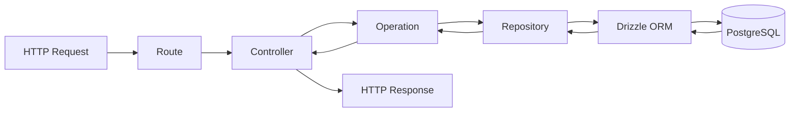

# Architecture

Deep-dive into how `portfolio-api` is structured and why. For setup instructions, see [readme.md](./readme.md).

## Guiding Principles

- **Feature-first**: application code lives in `app/src`, organized by responsibility (controller, operation, repository, routes), not by technical layer alone.
- **Shared library**: reusable, framework-agnostic building blocks (config, constants, DB/API schemas, logging, exceptions, validation) live in `lib` so every feature module consumes the same primitives.
- **Strict separation of concerns**: each layer has exactly one job and never reaches into another layer's responsibility.
- **Framework-agnostic business logic**: operations and repositories never import Hapi types — they can be unit tested or reused without an HTTP server.

## Request Flow



| Layer | Responsibility | Must NOT do |
| --- | --- | --- |
| **Route** (`app/src/routes`) | Declare HTTP method/path, attach Zod validation, bind to a controller handler. | Contain business logic. |
| **Controller** (`app/src/controller`) | Read `request.payload`/`params`/`query`, call one operation, shape the HTTP response. | Access the database, contain business rules. |
| **Operation** (`app/src/operation`) | Business rules, orchestrates repositories, maps entities to DTOs, throws domain exceptions (`AppError`). | Know about Hapi (`Request`/`ResponseToolkit`), return HTTP responses. |
| **Repository** (`app/src/repository`) | Insert/update/delete/find using Drizzle ORM only. | Contain business logic or validation. |
| **Shared Schema** (`lib/shared/schema`) | `db/` = Drizzle table definitions. `api/` = Zod request/response DTOs. | Contain business logic. |

## Plugins (`app/src/plugins`)

Hapi plugins wire shared infrastructure into the server at startup:

- **`database.plugin.ts`** — attaches the singleton Drizzle `db` client to `server.app.db` and closes the PostgreSQL connection pool on `onPostStop`.
- **`logger.plugin.ts`** — attaches the Pino `logger` to `server.app.logger` and logs every request's method/path/status/duration on the `response` event.
- **`validation.plugin.ts`** — decorates the server with `validatePayload(schema)` / `validateQuery(schema)`, adapting any Zod schema into a Hapi `validate` config (see below).

## Validation Pipeline

Zod schemas live in `lib/shared/schema/api/<module>` — this is the single source of truth for request shape, and is never duplicated in routes or controllers.

```
Route calls server.validatePayload(schema)
   -> Hapi calls schema.parseAsync(request.payload)
   -> on success: controller receives a fully-typed, parsed payload
   -> on failure: zodFailAction throws Boom.badRequest with { code, details } attached
   -> centralized error handler formats the response
```

## Error Handling Pipeline

Operations and repositories throw plain `AppError` subclasses (`lib/shared/exception`) — they know nothing about HTTP status codes as a *framework* concept, only as domain metadata carried on the error itself (`statusCode`, `code`, `details`).

A single Hapi extension, `registerErrorHandler` (`lib/shared/middleware/error-handler.middleware.ts`), registered once in `server.ts`, is the **only** place that turns errors into HTTP responses:

| Thrown error | Handling | Example |
| --- | --- | --- |
| `AppError` (e.g. `NotFoundException`) | Formatted directly using its `statusCode`/`code`/`details`. | Contact not found → `404` |
| `ZodError` (via `failAction`) | Wrapped as `Boom.badRequest` with `.data = { code, details }`, formatted centrally. | Invalid payload → `400` |
| Any other thrown error / Hapi-native Boom (e.g. unknown route) | Boomified by Hapi, logged if 5xx, formatted with a generic code. | Unknown route → `404`, DB failure → `500` |

Every error response has the same shape:

```json
{
  "success": false,
  "message": "Contact enquiry not found.",
  "code": "NOT_FOUND",
  "details": null
}
```

Every success response has the same shape (`lib/shared/schema/api/common/api-response.ts`):

```json
{
  "success": true,
  "message": "Contact enquiry submitted successfully.",
  "data": { "id": "...", "fullName": "...", "...": "..." }
}
```

## Configuration & Constants

- **`lib/config/env.ts`** — loads `.env` and validates it with a Zod schema; the app fails fast on startup if required variables are missing/invalid.
- **`lib/config/database.ts`** — creates the singleton `postgres` client and Drizzle `db` instance, shared by every repository.
- **`lib/config/app.config.ts`** — derived, environment-aware application settings (host/port/CORS/API prefix).
- **`lib/constants`** — centralizes route paths, HTTP status codes, table names, pagination defaults, and success/error messages so no string is hardcoded twice.

## Database

- PostgreSQL accessed via `postgres` (postgres-js) + `drizzle-orm/postgres-js`.
- Tables are UUID-keyed (`defaultRandom()`), defined in `lib/shared/schema/db`.
- Migrations are generated/applied with `drizzle-kit` (`lib/drizzle/drizzle.config.ts`); output goes to `lib/drizzle/migrations`.
- `lib/drizzle/seed/seed.ts` inserts sample data for local development.

## Logging

Pino (`lib/shared/logger/logger.ts`) is the only logger used in the codebase — `console.log` is banned by an ESLint rule (`no-console`). In development, output is piped through `pino-pretty`; in production it stays structured JSON.

## Adding a New Feature Module

Every future module (Auth, Blog, Analytics, Newsletter, Dashboard, ...) follows the exact same recipe as Contact:

1. **`lib/shared/schema/db/<module>.schema.ts`** — Drizzle table.
2. **`lib/shared/schema/api/<module>/`** — Zod request/response schemas + DTO mapper.
3. **`app/src/repository/<module>.repository.ts`** — Drizzle queries only.
4. **`app/src/operation/<module>/*.operation.ts`** — one file per use case, business rules + domain exceptions.
5. **`app/src/controller/<module>/<module>.controller.ts`** — thin HTTP adapter over the operations.
6. **`app/src/routes/<module>.route.ts`** — route table using `server.validatePayload`/`validateQuery`.
7. Register the new route module in `app/src/server.ts`.

No existing module needs to change to support the new one — this is what keeps the architecture scalable as Auth, RBAC, Blog, Analytics, Resume Downloads, Newsletter, Dashboard, File Upload, Email Service, Background Jobs, Redis Cache, and Notifications are added over time.

## Tech Stack Reference

| Concern | Choice |
| --- | --- |
| Runtime | Bun |
| HTTP framework | Hapi.js |
| Language | TypeScript (strict mode) |
| ORM | Drizzle ORM |
| Database | PostgreSQL |
| Schema validation | Zod |
| Logging | Pino |
| Env loading | dotenv |
| Lint/format | ESLint (flat config) + Prettier |
